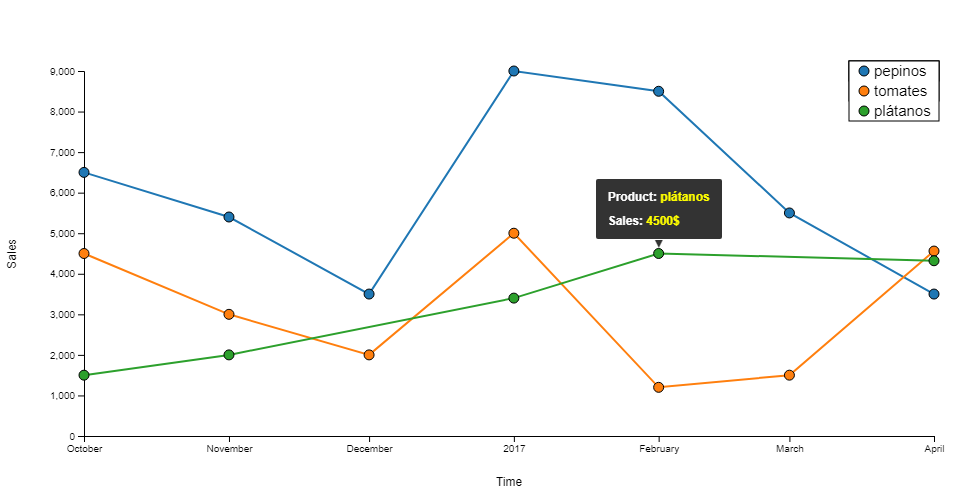

# D3js Line Chart Visualization
## The target of this script is to Create a Line chart adding dots and interaction (whenever you click on the dots display information).
### We have introduced several important improvements as
#### - Change the event click by mouseover and mouseleft
#### - Refresh the chart on any change in the load file
#### - In the load file you can introduce some charts (not only one)

### Final result



The chart shows the sales of several products in our company

---

### Usage

> Open _index.html_ on your favorite web browser.
> You could need to open a lite-server
> The load file has to be a csv file with this format:
> * date: date with format DD-MM-YY
> * sales: integer with amount of sales of this date
> * chart: the id chart
> * product: string with the namber of the product

---

### Implementation overview

The sample data are in the file: _data.csv_

**1. Refresh Chart**

The following code refresh the chart every n miliseconds (in this example n=500000):

```javascript
//We call these functions
refreshChart();
autoRefreshChart(500000);

function autoRefreshChart(miliSeconds) {
  setInterval(function () {
    refreshChart();
  }, miliSeconds);
}

function refreshChart() {
  d3.csv("data.csv", function (error, data) {
    if (error) throw error;
    // parse the date / time
    var parseTime = d3.timeParse("%d-%b-%y");
    
    data.forEach(function (d,i) {
      d.date = parseTime(d.date);
      d.sales = +d.sales;
      d.chart = +d.chart;
      d.product=d.product;
    });
    clearCanvas();
    drawChart(data)
  });
}
```

**2. DrawChart**

It´s the function to draw all the charts, points and leyends

```javascript
function drawChart(totalSales) {
  setupXScale(totalSales);
  setupYScale(totalSales);
  appendXAxis(totalSales);
  appendYAxis(totalSales);

  //Calculate the number of charts
  var numcharts = d3.max(totalSales, function (d, i) {
    return d.chart;
  });
  var data_for_legend=[];
  var i;
  
  //iterate on every chart to draw them on the canvas
  for (i = 1; i < numcharts + 1; i++)
  { 
    chart=totalSales.filter(totalSales => totalSales.chart === i);

    var newchart=[];
    
    newchart=totalSales.filter(totalSales => totalSales.chart === i);
    appendLineCharts(newchart);
    appendDot(newchart,i);
    data_for_legend.push({"product":newchart[0].product})
  }
  
  appendLegend(data_for_legend)  
  
}
```

**2.1 Draw lines of the charts**

We call the next function

```javascript
function appendLineCharts(totalSales) {

  // define the line
  var valueline = d3.line()
    .x(function (d) {
      //console.log('linea:', x(d.date));
      return x(d.date);
    }) 
    .y(function (d) { return y(d.sales); });

  // Add the valueline path.
  svg.append("path")
    .data([totalSales])
    //.attr("class", "line")
    .attr("d", valueline)
    .style("fill", "none")
    .style('stroke', function(d) {console.log("product line:",d[0].product);
                                  console.log("color line:",barColor(d[0].product));
                                  return barColor(d[0].product);})
    //.style("stroke", totalSales[0])
    .style("stroke-width", "2px");
}
```

**2.2 Draw interactive dots on the charts**

We call the next function

```javascript
function appendDot(totalSales,i) {

  var tip = d3.tip()
  .attr('class', 'd3-tip')
  .offset([-10, 0])
  .html(function(d) {
    return "<strong>Product:</strong> <span style='color:yellow'>" + d.product + "</span>" + "</br>"+ "</br>"
          + "<strong>Sales:</strong> <span style='color:yellow'>" + d.sales +"$"+ "</span>" 
    ;});

  svg.call(tip);

  svg.selectAll("circle"+i)
    .data(totalSales)
    .enter().append("circle")
    .attr("class", "circle")
    .attr('fill', function(d) {
      console.log("color dot:",barColor(d.product));
      return barColor(d.product);
      
      })
    
    .attr("r", 5)
    .attr("cx", function(d) { return x(d.date); })
    .attr("cy", function(d) { return y(d.sales); })
    .on('mouseover', tip.show)
    .on('mouseout', tip.hide);
    
}
```

A specific CSS style has been created for the tool type

```css
.d3-tip {
  line-height: 1;
  font-weight: bold;
  padding: 12px;
  background: rgba(0, 0, 0, 0.8);
  color: #fff;
  border-radius: 2px;
}

/* Creates a small triangle extender for the tooltip */
.d3-tip:after {
  box-sizing: border-box;
  display: inline;
  font-size: 12px;
  width: 100%;
  line-height: 1;
  color: rgba(0, 0, 0, 0.8);
  content: "\25BC";
  position: absolute;
  text-align: center;
}

/* Style northward tooltips differently */
.d3-tip.n:after {
  margin: -1px 0 0 0;
  top: 100%;
  left: 0;
}
```
**2.3 draw the leyend on the canvas**

We call the next function

```javascript
//  Now let's add a Legend
 function appendLegend(totalSales){

  legend = svg.append('g')
	  .attr('class', 'legend')
	  .attr('height', 100)
    .attr('width', 100)
  
  legend.selectAll('rect')
    .data(totalSales)
    .enter()
    .append('rect')
	  .attr('x', width-85)
    .attr('y', -10)
    .attr('width', 90)
	  .attr('height', (function(d, i){ return 20+(i *  20)}))  
  
  legend.selectAll('circle')
    .data(totalSales)
    .enter()
    .append('circle')
	  .attr('cx', width - 70)
    .attr('cy', (d, i)=> i *  20)
	  .attr('r', 5)
    .attr('fill', function(d) {
            return barColor(d.product);      
      })
    .attr('class', 'circle');
    
  legend.selectAll('text')
    .data(totalSales)
    .enter()
    .append('text')
	  .attr('x', width - 60)
    .attr('y',function(d, i) { return i *  20+5;
      console.log('valor: ',d);})
	  .text(function(d){ return d.product});
}
```
A specific CSS style has been created for the tool type

```css
.legend {
  font: 15px sans-serif;
}

.legend rect{
  fill:white;
  stroke:black;
}
```

**3. X/Y axis**

We draw the X and X axis

```javascript
function setupXScale(totalSales) {

  x = d3.scaleTime()
    .range([0, width])
    .domain(d3.extent(totalSales, function (d) { return d.date }));
}

// Now we don't have a linear range of values, we have a discrete
// range of values (one per product)
// Here we are generating an array of product names
function setupYScale(totalSales) {
  var maxSales = d3.max(totalSales, function (d, i) { return d.sales; });

  y = d3.scaleLinear()
    .range([height, 0])
    .domain([0, maxSales]);

}

function appendXAxis(totalSales) {
  // Add the X Axis
  svg.append("g")
    .attr("transform", `translate(0, ${height})`)
    .call(d3.axisBottom(x))
    svg.append("text")             
    
    .attr("y", height+ margin.top -25)
    .attr("x",(width / 2))
    .style("text-anchor", "middle")
    .text("Time");
}

function appendYAxis(totalSales) {
  // Add the Y Axis
  svg.append("g")
    .call(d3.axisLeft(y))
    svg.append("text")
    .attr("transform", "rotate(-90)")
    .attr("y", 0 - margin.left)
    .attr("x",0 - (height / 2))
    .attr("dy", "1em")
    .style("text-anchor", "middle")
    .text("Sales");
}
```

Axis values have an especific CSS style:

```css
.axis path,
.axis line {
  fill: none;
  stroke: #000;
  shape-rendering: crispEdges;
}
```

